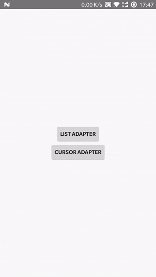

# yrecyclerview
一个简单的Recyclerview库，下拉刷新、自动刷新、上拉加载、可添加Header、Footer、EmptyView，支持点击、长按、创建上下文菜单事件，支持List集合和数据库Cursor两种模式

> YRecyclerView 基类

> LoadRecyclerView 可上拉加载的RecyclerView

> YSwipeRefreshLayout 可自动刷新的SwipeRefreshLayout

> LoadOrRefreshView 可下拉刷新、自动刷新、上拉加载

效果图：



Cursor ADAPTER的展示效果和LIST ADAPTER一样，需要的可以下载DEMO查看如何使用**RecyclerCursorAdapter**

## How to

To get a Git project into your build:

Step 1. Add the JitPack repository to your build file

Add it in your root build.gradle at the end of repositories:
```gradle
	allprojects {
		repositories {
			...
			maven { url 'https://jitpack.io' }
		}
	}
```
Step 2. Add the dependency:
```gradle
	dependencies {
	        compile 'com.github.wtuadn:yrecyclerview:v1.0.3'
	}
```